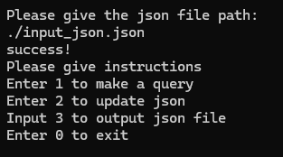
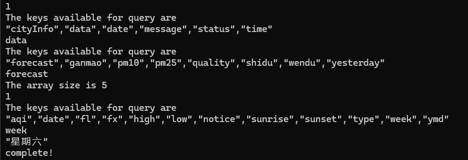
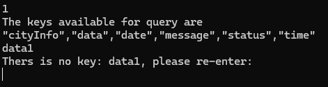
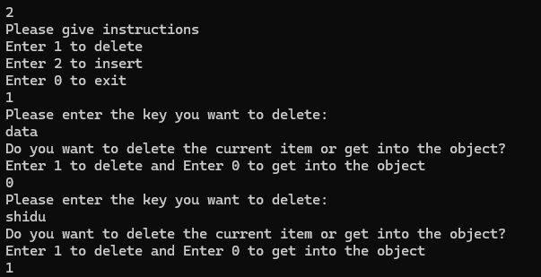
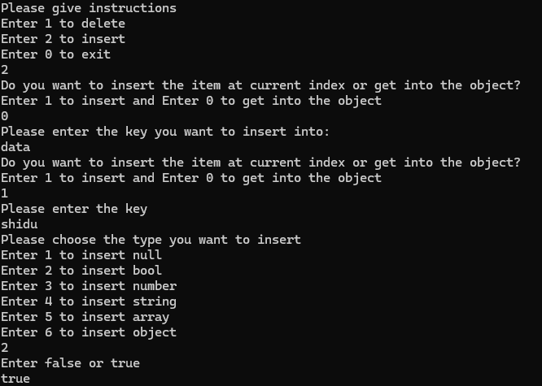
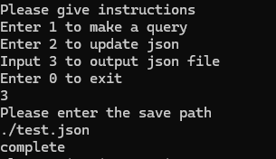
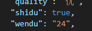

# 引言

实现的功能如下：

1、查询json功能

2、更新json功能（包含删除和插入）

3、输出json功能

启动程序后首先要求输入需要解析的json路径，之后会有互动选项。

# 查询

键入1可以进入查询界面。若当前所在json对象的类型为object则会给出可供查询的键，若当前所在json对象类型为array则会给出可供查询的下标范围，若object嵌套array或object则会继续询问直到返回非array或object类型的json对象。

若输入不存在的key或越界会给出提示重新输入。

# 删除和插入

输入2可以进入到更新json界面。接着可以进一步输入1和2进行插入或删除操作。由于json是嵌套结构，当进行删除和插入操作时，用户可以选择键入1在当前这一层删除或插入，也可以键入0选择进入到下一层继续访问直到找到自己想要删除或插入的位置。

对于插入操作来说，需要给出插入的对象类型和实际的值，若插入的对象为object类型还需要给出插入值对应的key。

# 输出并保存

键入3并给出输出文件的地址，可以将当前修改过的json文件保存并输出。

输出文档中的值已经改变。

